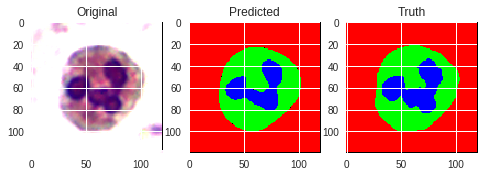

# Master project
Master project for Bioinformatics and Biostatistics master degree.

Data used in this project comes from _Dataset1_ from: Zheng, Xin (2018), Data for: Fast and robust segmentation of cell images by self-supervised learning, Mendeley Data, v1 http://dx.doi.org/10.17632/w7cvnmn4c5.1

## Semantic segmentation of peripheral blood leukocytes using neural networks 
#### Abstract
Semantic segmentation is the differentiation of the meaningful parts on an image. It has been used in many distinct fields, such as traffic or medical areas. One of these uses in the medical field is the blood smear examination. White blood cells (WBC) are part of the immune system and their counting and determination is often performed by medical specialists for diagnosis. The shape and size of the nucleus of leukocytes can determine the type of WBC, by visual examination of an expert. Thus automatic segmentation of these cells may reduce the time and even improve the accuracy of a medical diagnosis.  

 

WBC segmentation had been proposed before, but the convolutional neural network architectures were not tried for this task. Therefore, in this project, the semantic segmentation was performed on free access dataset, which is composed of microscopic images and segmented ground truth images, of WBC, made by experts. The dataset was filtered, transformed and augmented in order to be used in an artificial neural network. Some segmentation models, such as U-Net, SegNet and DeconvNet, were chosen, adapted and trained to/with this data. These architectures are known very well and have been employed in segmentation tasks since at least 2015. After training, the models were evaluated, using different metrics (accuracy, Jaccard similarity index and Sørensen–Dice similarity coefficent), with the same dataset, although the validation images were not included in training, thus they were new to the models. Jupyter notebook from the free Google platform called Colaboratory was used for the training and evaluation of the models.

Although all three models achieved very high scores in distinct metrics (*>0.93 in DSC and Jaccard*). U-Net architecture resulted in being the best model for segmenting, as well as the fastest one for the training process.

##### Full Text

Link : http://hdl.handle.net/10609/90265
